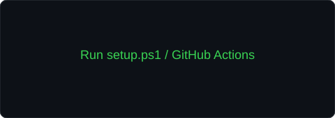

<div align="center">

<!-- PORTRAIT - generated from your own photo with scripts/dotify.py -->
<!-- Put your photo at me.jpg, then run: .\setup.ps1 -Username JPG-Ayu -Name "Ayush Singh" -Image .\me.jpg -Circle -->


<br>

<a href="https://github.com/JPG-Ayu">
  
</a>

<br>

<a href="https://github.com/JPG-Ayu"></a>
<a href="https://www.linkedin.com/in/ayush-singh-6b9064403/"></a>


</div>

---

## `~/` whoami

```console
$ cat about.txt
```

Hi, I'm **Ayush Singh**. I'm a BCA student who enjoys building things, learning new technologies, and turning ideas into working projects.

- Currently building and improving my developer portfolio
- GitHub: **[@JPG-Ayu](https://github.com/JPG-Ayu)**
- Learning and exploring **web development, programming and AI**
- Fun fact: **I like learning by building instead of only reading about it.**

<br>

<div align="center">

## `~/` toolbox


</div>

---

<div align="center">

## `~/` skill radar

<table>
<tr>
<td width="50%" align="center" valign="middle">

<picture>
  <source media="(prefers-color-scheme: dark)" srcset="assets/radar-dark.svg">
  <source media="(prefers-color-scheme: light)" srcset="assets/radar-light.svg">
  
</picture>

</td>
<td width="50%" align="center" valign="middle">

<picture>
  <source media="(prefers-color-scheme: dark)" srcset="assets/radar-langs-dark.svg">
  <source media="(prefers-color-scheme: light)" srcset="assets/radar-langs-light.svg">
  
</picture>

</td>
</tr>
</table>

</div>

---

<div align="center">

## `~/` contribution calendar

<!-- Regenerated by .github/workflows/metrics.yml -->


<br><br>

<!-- Generated by .github/workflows/snake.yml -->
<picture>
  <source media="(prefers-color-scheme: dark)" srcset="https://raw.githubusercontent.com/JPG-Ayu/profile/output/snake-dark.svg">
  <source media="(prefers-color-scheme: light)" srcset="https://raw.githubusercontent.com/JPG-Ayu/profile/output/snake.svg">
  
</picture>

</div>

---

<div align="center">

## `~/` the numbers

<picture>
  <source media="(prefers-color-scheme: dark)" srcset="assets/card-stats-dark.svg">
  <source media="(prefers-color-scheme: light)" srcset="assets/card-stats-light.svg">
  
</picture>

<br>


<br><br>


</div>

---

<div align="center">

## `~/` selected work

<!-- Project cards are generated from assets/projects.json -->

<table>
<tr>
<td width="50%">
  <a href="https://github.com/JPG-Ayu/profile">
    <picture>
      <source media="(prefers-color-scheme: dark)" srcset="assets/card-profile-dark.svg">
      <source media="(prefers-color-scheme: light)" srcset="assets/card-profile-light.svg">
      
    </picture>
  </a>
</td>
</tr>
</table>

<sub>

| project | live | stack |
|---|---|---|
| **[profile](https://github.com/JPG-Ayu/profile)** | — | `Markdown` `GitHub Actions` |

</sub>

</div>

---

<div align="center">
<sub>`01110100 01101000 01100001 01101110 01101011 01110011 00100000 01100110 01101111 01110010 00100000 01110011 01100011 01110010 01101111 01101100 01101100 01101001 01101110 01100111`</sub>
</div>
